# Phase 2A Handoff: Component Extraction Progress

**Date:** January 4, 2026  
**Session:** Phase 2A - embeddenator-vsa Complete, 5 Components Remaining  
**Status:** 1/6 Components Extracted ✅

---

## Executive Summary

Successfully completed **embeddenator-vsa extraction** (Issue #18), the first of six Phase 2A component decompositions. The VSA component is now a standalone library with full test coverage, integrated back into the monorepo via path dependency.

**Progress:** 16.7% complete (1/6 components)  
**Next:** Extract embeddenator-retrieval (depends on vsa)

---

## Phase 2A Overview

Goal: Decompose monolithic embeddenator into 6 focused component libraries for improved modularity, independent versioning, and faster compilation.

### Extraction Strategy (ADR-017)

**Dependency-Driven Order:**
```
1. ✅ embeddenator-vsa (foundational, no deps) - COMPLETE
2. → embeddenator-retrieval (depends on vsa)
3. → embeddenator-fs (depends on vsa, retrieval)
4. → embeddenator-interop (depends on vsa, fs)
5. → embeddenator-io (parallel, no deps)
6. → embeddenator-obs (parallel, no deps)
```

**Workflow per component:**
1. Security audit (if unsafe code)
2. Create feat/extract-<component> branch
3. Copy modules to component repo
4. Migrate tests & benchmarks
5. Update monorepo with path dependency
6. Fix imports, verify builds & tests
7. Tag release, close issue, push to GitHub

---

## Completed: embeddenator-vsa (Issue #18)

### What Was Done

**1. Security Audit**
- Audited 5 unsafe blocks in simd_cosine.rs
- All approved as safe (AVX2, NEON SIMD optimizations)
- Documentation: [docs/SECURITY_AUDIT_SIMD_COSINE.md](SECURITY_AUDIT_SIMD_COSINE.md)

**2. Component Extraction**
- **Modules extracted:** 6 files (~4,252 LOC)
  - vsa.rs - Core VSA operations
  - ternary.rs - Ternary primitives
  - ternary_vec.rs - Packed trit vectors
  - codebook.rs - Symbol-to-vector mappings
  - dimensional.rs - Dimensional operations
  - simd_cosine.rs - SIMD-accelerated similarity

- **Tests migrated:** simd_cosine_tests.rs
- **Benchmarks migrated:** vsa_ops.rs, simd_cosine.rs

**3. Monorepo Integration**
- Added dependency: `embeddenator-vsa = { path = "../../embeddenator/embeddenator-vsa" }`
- Updated imports in 6 files: cli.rs, correction.rs, embrfs.rs, kernel_interop.rs, resonator.rs, retrieval.rs
- Pattern: `crate::vsa::` → `embeddenator_vsa::`
- Re-exported types from lib.rs for API compatibility

**4. Verification**
- ✅ embeddenator-vsa builds independently
- ✅ embeddenator builds with vsa dependency
- ✅ All 19 lib tests pass
- ✅ No performance regression

**5. Release**
- Tagged: **v0.2.0**
- Issue #18: Closed
- Commits:
  - `5cc73b7` - Security audit
  - `632aa36` - Extract VSA modules (vsa repo)
  - `3302bec` - Add tests & benchmarks (vsa repo)
  - `b9ad4e6` - Integrate vsa (monorepo)

### Repository States

**embeddenator (monorepo)**
- Branch: `feat/extract-vsa`
- Builds: ✅
- Tests: ✅ (19/19 pass)
- Removed: 6 VSA module files
- Added: 1 dependency (embeddenator-vsa)

**embeddenator-vsa (component)**
- Location: `~/Documents/projects/embeddenator/embeddenator-vsa`
- Branch: `main`
- Version: v0.2.0
- Builds: ✅
- Tests: ✅ (with minor deprecation warnings)
- Size: 6 modules, 3 test/bench files

---

## Remaining Components (5/6)

### Priority 1: embeddenator-retrieval (Issue #19)
**Depends on:** vsa (✅ ready)  
**Blocks:** fs  
**Timeline:** Week 1-2 (Jan 7-14)

**Modules to extract:**
- `retrieval.rs` - Search and query operations
- `resonator.rs` - Resonator logic
- `signature.rs` - Signature generation

**Prerequisites:**
- [ ] Audit for unsafe code
- [ ] Create branch: feat/extract-retrieval
- [ ] Verify vsa dependency works

### Priority 2: embeddenator-fs (Issue #20)
**Depends on:** vsa (✅), retrieval (pending)  
**Blocks:** interop  
**Timeline:** Week 2 (Jan 11-17)

**Modules to extract:**
- `embrfs.rs` - EmbrFS core filesystem logic
- `fuse_shim.rs` - FUSE integration (platform-specific)

**Prerequisites:**
- [ ] Wait for retrieval extraction
- [ ] Audit unsafe code in embrfs/fuse_shim
- [ ] Document FUSE platform requirements

### Priority 3: embeddenator-interop (Issue #21)
**Depends on:** vsa (✅), fs (pending)  
**Timeline:** Week 2-3 (Jan 14-21)

**Modules to extract:**
- `kernel_interop.rs` - Kernel integration

**Prerequisites:**
- [ ] Wait for fs extraction
- [ ] Audit unsafe code
- [ ] Document kernel ABI requirements

### Independent: embeddenator-io (Issue #22)
**Depends on:** None (can start anytime)  
**Timeline:** Week 3 (Jan 18-24)

**Modules to extract:**
- `io/envelope.rs` - Binary envelope, compression codecs

**Prerequisites:**
- [ ] Audit envelope.rs
- [ ] Document compression codec requirements
- [ ] Set up feature flags: compression-zstd, compression-lz4

### Independent: embeddenator-obs (Issue #23)
**Depends on:** None (can start anytime)  
**Timeline:** Week 3 (Jan 18-24)

**Modules to extract:**
- `logging.rs` - Logging infrastructure
- `metrics.rs` - Metrics collection
- `hires_timing.rs` - High-resolution timing

**Prerequisites:**
- [ ] Audit observability modules
- [ ] Document feature flag strategy
- [ ] Set up optional feature: logging

---

## Critical Path

```mermaid
graph TD
    A[✅ vsa v0.2.0] --> B[retrieval]
    B --> C[fs]
    C --> D[interop]
    E[io - independent]
    F[obs - independent]
    
    style A fill:#90EE90
    style B fill:#FFD700
    style C fill:#FFA500
    style D fill:#FFA500
    style E fill:#87CEEB
    style F fill:#87CEEB
```



**Week 1:** vsa ✅ → retrieval  
**Week 2:** retrieval → fs → interop  
**Week 3:** interop complete, io + obs (parallel)  
**Week 4:** Integration testing, documentation, Phase 2A complete

---

## Key Learnings from VSA Extraction

### What Went Well ✅
1. **Security audit first** - Documented unsafe code before extraction
2. **Feature branching** - Clean isolation with feat/extract-vsa
3. **Backup strategy** - .bak files before deletion (though removed later)
4. **Path dependencies** - Relative paths work correctly
5. **Incremental testing** - Build → test → integrate → verify

### Challenges Encountered ⚠️
1. **Import updates** - Required sed commands for bulk replacements
2. **Module conflicts** - Had to remove old vsa/ directory structure
3. **Platform-specific SIMD** - Needed conditional compilation for exports
4. **Deprecation warnings** - Some APIs marked deprecated in tests

### Best Practices Established 📋
1. Always audit unsafe code before extraction
2. Use sed for bulk import pattern replacements
3. Verify builds at each step (component, then monorepo)
4. Keep .bak files until final commit
5. Update re-exports in lib.rs for API compatibility

---

## Next Session Checklist

### Immediate (embeddenator-retrieval)
- [ ] Create branch: `git checkout -b feat/extract-retrieval`
- [ ] Audit retrieval.rs, resonator.rs, signature.rs for unsafe code
- [ ] Initialize/verify embeddenator-retrieval repo structure
- [ ] Copy modules from monorepo
- [ ] Update Cargo.toml: add embeddenator-vsa dependency
- [ ] Copy relevant tests (grep for "retrieval", "resonator")
- [ ] Build and test component repo
- [ ] Update monorepo: add retrieval path dependency
- [ ] Fix imports: `crate::retrieval` → `embeddenator_retrieval`
- [ ] Verify monorepo builds and tests pass
- [ ] Tag v0.1.0 (or v0.2.0 if already exists)
- [ ] Close issue #19
- [ ] Update issue #24 (Phase 2A tracker)

### Maintenance
- [ ] Keep feat/extract-vsa branch for now (reference)
- [ ] Merge feat/extract-retrieval → feat/component-architecture-clean when done
- [ ] Update SPLIT_TRACKER.md after each extraction
- [ ] Archive this handoff when Phase 2A completes

---

## Repository Locations

**Monorepo:**  
`/home/kang/Documents/projects/github/embeddenator`

**Component Repos:**  
`~/Documents/projects/embeddenator/`
- embeddenator-vsa/ ✅
- embeddenator-retrieval/
- embeddenator-fs/
- embeddenator-interop/
- embeddenator-io/
- embeddenator-obs/

**Note:** Component repos already exist from Phase 1 but may have skeleton code. Actual module extraction happens in Phase 2A.

---

## Issue Tracking

**Epic:** #24 - Phase 2A Component Decomposition Tracker

**Component Issues:**
- ✅ #18 - embeddenator-vsa (CLOSED)
- ⏳ #19 - embeddenator-retrieval (NEXT)
- ⏳ #20 - embeddenator-fs
- ⏳ #21 - embeddenator-interop
- ⏳ #22 - embeddenator-io
- ⏳ #23 - embeddenator-obs

---

## Success Criteria (Phase 2A Complete)

- [ ] All 6 components extracted
- [ ] Each component builds independently
- [ ] Embeddenator builds with all component dependencies
- [ ] Full test suite passes (embeddenator + components)
- [ ] Benchmarks show <5% regression
- [ ] All components tagged with release versions
- [ ] All component issues (#18-#23) closed
- [ ] Issue #24 (epic) marked complete
- [ ] SPLIT_TRACKER.md Phase 2A marked ✅
- [ ] Documentation updated (README, ADRs)

---

## References

- [ADR-017: Phase 2A Component Extraction Strategy](../adr/ADR-017-phase2a-component-extraction.md)
- [SECURITY_AUDIT_SIMD_COSINE.md](SECURITY_AUDIT_SIMD_COSINE.md)
- [CRATE_STRUCTURE_AND_CONCURRENCY.md](CRATE_STRUCTURE_AND_CONCURRENCY.md)
- [LOCAL_DEVELOPMENT.md](LOCAL_DEVELOPMENT.md)

**GitHub Issues:** https://github.com/tzervas/embeddenator/issues?q=is%3Aissue+label%3Aphase-2a

---

**Handoff Status:** Ready for embeddenator-retrieval extraction  
**Next Agent:** Continue Phase 2A with issue #19  
**Estimated Completion:** January 28, 2026
